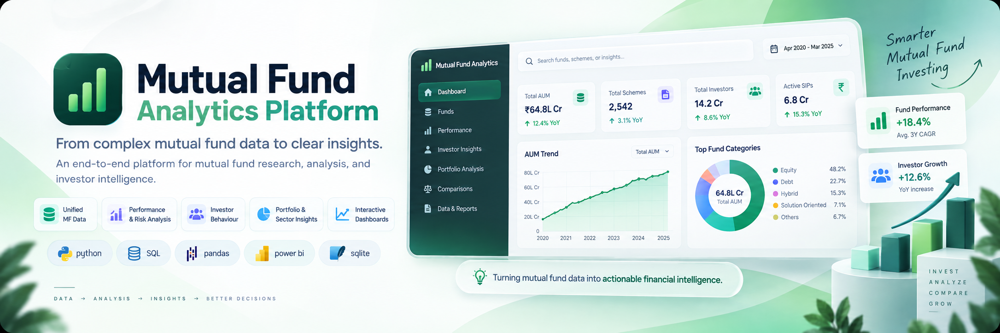

<p align="center">
  
</p>

<p align="center">
  A data analytics platform for exploring mutual fund performance, AUM, SIP flows, investor behaviour and market trends.
</p>

<p align="center">
  <a href="https://www.python.org/"></a>
  <a href="https://pandas.pydata.org/"></a>
  <a href="https://www.sqlite.org/"></a>
  <a href="https://jupyter.org/"></a>
</p>

<p align="center">
  <a href="#overview">overview</a> ┬╖
  <a href="#progress">progress</a> ┬╖
  <a href="#technology">technology</a> ┬╖
  <a href="#project-structure">project structure</a> ┬╖
  <a href="#documentation">documentation</a> ┬╖
  <a href="#roadmap">roadmap</a>
</p>

---

<h2 align="center">overview</h2>

**Mutual Fund Analytics Platform** is an end-to-end data analytics project focused on turning mutual fund datasets into structured analysis and insights.

The project covers data ingestion, cleaning and validation, SQLite-based data storage, SQL analysis and exploratory data analysis. Later phases will extend the platform into fund performance analytics, interactive dashboards and advanced analytics.

---

<h2 align="center">progress</h2>

**🚧 active development · phase 3 / 7**

**current phase:** Exploratory Data Analysis

| Phase | Status |
|---|---|
| Data ingestion | Γ£ô |
| Data cleaning & SQL database | Γ£ô |
| Exploratory Data Analysis | → |
| Fund performance analytics | Γùï |
| Interactive dashboard | Γùï |
| Advanced analytics | Γùï |
| Final documentation & delivery | Γùï |

The detailed implementation progress is maintained in [`project_journey.md`](project_journey.md).

### completed

- project setup and data ingestion
- 10 core mutual fund datasets loaded
- selected NAV data fetched for analysis
- data cleaning and validation
- cleaned datasets generated
- SQLite database created and loaded
- analytical SQL queries
- data dictionary

### current

- exploratory analysis across NAV, AUM, SIP flows, investor behaviour, folio growth and sector allocation
- quantified EDA findings

---

<details>
<summary><strong>EDA coverage</strong></summary>

- NAV trends across mutual fund schemes
- AUM growth across fund houses
- monthly SIP inflow trends
- category-wise fund inflows
- investor age and gender distribution
- investor transaction activity by state
- T30 vs B30 investor distribution
- mutual fund folio growth
- NAV return correlation across selected funds
- aggregate sector allocation across equity funds

</details>

---

<h2 align="center">technology</h2>

| Layer | Technology |
| --------------------- | ---------------------------- |
| **Language** | Python |
| **Data processing** | Pandas, NumPy |
| **Database** | SQLite |
| **Analytics** | SQL, Jupyter Notebook |
| **Data source** | Mutual fund datasets, selected NAV data |

---

<h2 align="center">project structure</h2>

```text
mutual-fund-analytics/
├── data/
│   ├── raw/
│   └── processed/
│
├── dashboard/
│
├── docs/
│   ├── assets/
│   │   └── mutual-banner.png
│   └── data_dictionary.md
│
├── notebooks/
│   └── 03_eda_analysis.ipynb
│
├── reports/
│   ├── 03_eda_analysis.html
│   ├── day1_summary.txt
│   └── day2_summary.txt
│
├── scripts/
│   ├── check_pandas.py
│   ├── data_cleaning.py
│   ├── data_ingestion.py
│   ├── explore_fund_master.py
│   ├── fetch_multiple_nav.py
│   ├── live_nav_fetch.py
│   ├── load_sqlite.py
│   ├── process_remaining.py
│   ├── test.py
│   └── validate_amfi_codes.py
│
├── sql/
│   ├── queries.sql
│   └── schema.sql
│
├── bluestock_mf.db
├── project_journey.md
├── README.md
└── requirements.txt
```

---

<h2 align="center">documentation</h2>

- **Data Dictionary** — structure and meaning of the project datasets
- **Project Journey** — phase-by-phase development progress
- **EDA Report** — exported exploratory analysis
- **Day Summaries** — development and analysis notes

Detailed documentation is available in `docs/`, `reports/` and `project_journey.md`.

---

<h2 align="center">roadmap</h2>

The platform is being developed across 7 phases:

1. project setup & data ingestion
2. data cleaning & SQL database
3. exploratory data analysis
4. fund performance analytics
5. interactive dashboard
6. advanced analytics
7. final documentation & delivery

Planned analytics include return and CAGR calculations, risk metrics, benchmark comparison, investor cohort analysis, SIP continuity analysis and sector concentration analysis.

---

See you in the next phase.

**ΓÇö aps**
